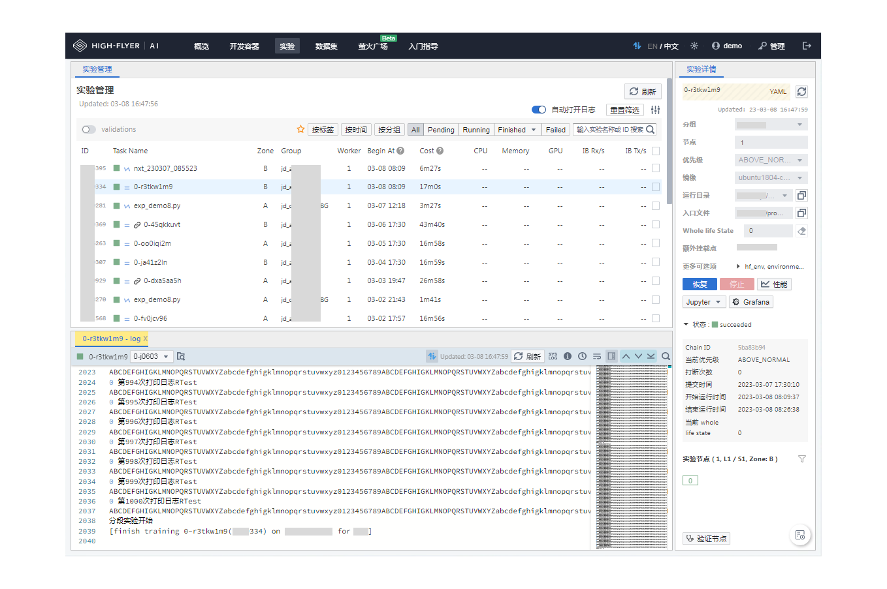

# Studio

<div align="center">
  

  <p align="center">
      
      <a href="https://github.com/HFAiLab/hai-platform-studio"></a>
  </p>
</div>

## 介绍

[HAI Platform Studio](https://github.com/HFAiLab/hai-platform-studio) 是为 [HAI Platform](https://github.com/HFAiLab/hai-platform) 提供的用户界面，主要的功能包括但不限于：

- 管理和启动基于 JupyterLab 的开发容器，配合 Jupyter 插件，可以进行代码调试或任务提交。
- 管理提交的实验，支持实验的实时监控、日志分析和实验状态管理。
- 另外本项目还集成了讨论区、实验性能监控、实验调度管理等功能。

另外，本项目 `/monitor` 子应用集成了一定的监控和管理能力，包括：

- 用户及实验管理：创建用户；修改用户分组、Quota；管理用户开发容器和实验；
- 节点管理：查看分组节点以及各个节点的详细信息。



## 调试与部署

在调试前，请先确保已经成功部署了 HAI Platform 后端。

### 项目架构介绍

本项目主要包含了一个基于 [React](https://reactjs.org/) 的 Studio 前端项目，一个基于 [Vue.js](https://vuejs.org/) 的 Monitor 页面和一个基于 [Node.js](https://nodejs.org/en/) 的后端接入层。

目录结构：

```shell
├── apps
│   ├── studio：studio 用户实验管理页面
│   └── monitor：监控管理页面
├── packages
│   ├── studio-pages：studio 中的实验列表、日志、实验详情等核心组件，这部分在 jupyter 插件中进行了复用。
│   ├── studio-schemas：studio 中用到的一些 Typescript Schema
│   └── studio-toolkit：studio 中用到的一些工具函数
├── servers
│   └── ailab-server：基于 Node.js 的接入层
└── shared
    ├── client-ailab-server：接入层 http 请求的管理实例
    ├── client-api-server：http 请求的管理实例
    ├── i18n：语言包
    ├── icons：通用 icons 集合
    ├── io-frontier：基于 websocket 的长链接管理库
    ├── shared：全局通用的 schema、工具函数等
    └── x-editor：封装了二次开发的 markdown 编辑器 @hai-platform/vditor
```

### 本地调试

#### 1. 填写 `.devrc` 配置文件

为了方便定义我们调试中的依赖项目，我们定义了一个 [`.devrc`](https://github.com/HFAiLab/hai-platform-studio/blob/main/.devrc) 文件，它基于 [JSON5](https://json5.org/) 规范，我们可以在其中定义本地开发的配置内容。

[`.devrc`](https://github.com/HFAiLab/hai-platform-studio/blob/main/.devrc) 文件中定义了我们调试开发中需要用到的后端服务、数据库等配置，其中标注 **`[必填]`** 的为必须要填写的项目。

另外，我们项目中默认可以使用一些第三方依赖：

- 使用 [Countly](https://countly.com/) 进行监控上报，可以通过配置包含 `countly` 的字段进行开启。
- 使用 [Meilisearch](https://www.meilisearch.com/) 提供讨论区模块的搜索服务，可以通过配置 `MEILI_SEARCH` 相关字段开启。

**注意**：在生产环境中，可以通过环境变量指定相关变量，相关变量的全大写格式即为环境变量的 key

#### 2. 本地调试

环境依赖：

- node >= 18
- pnpm >= 7.24.0

先执行依赖安装等一些初始化操作：

在终端执行：

```shell
pnpm first
```

开启 `ailab-server` 接入层的调试：

```shell
cd servers/ailab-server/
pnpm start
```

开启 `studio` 前端页面的调试：

```shell
cd apps/studio/
pnpm start
```

开启 `monitor` 前端页面的调试：

```shell
cd apps/monitor/
pnpm start
```

此时，应该能够看到提示打开 URL，在浏览器中打开即可调试。

#### 3. 扩展功能

在当前的开源版本中，部分功能我们并未提供完整的自定义实现，这部分功能如果需要，可以进行二次实现，同时为了方便实现，我们对这些功能的入口和 schema 进行了保留。

模块：

- [Fetion](https://github.com/HFAiLab/hai-platform-studio/blob/main/servers/ailab-server/src/biz/agg-fetion/fetion/public/index.ts): Fetion 可以用于处理告警信息，可以通过自定义 `CustomFetion` 的方式覆盖默认行为。
- [Statistics](https://github.com/HFAiLab/hai-platform-studio/blob/main/servers/ailab-server/src/biz/custom-statistics/public/index.ts): Statistics 文件包含了我们的一些用户统计数据的接口，可以自行实现相关函数完成统计功能。
- [PathGuide 组件](https://github.com/HFAiLab/hai-platform-studio/blob/main/apps/studio/src/biz-components/Panels/PathGuide/public/index.tsx): 由于使用场景不同，这个组件的展示默认被屏蔽，这里可以罗列一些实际使用中可能有用的路径，并且将其展示给用户。
- 讨论区通知模块：我们在项目中携带了一个讨论区模块，不过要完整地使用其通知能力，还需要自行填入数据库模板，我们在[这里](https://github.com/HFAiLab/hai-platform-studio/servers/mainab-server/src/orm/db_log/xtopic_notification_demo.sql) 给出了一个示例内容，这部分模板需要插入到 `frontend.topic_notification_template` 中。

通用能力：

- [i18n 多语言](https://github.com/HFAiLab/hai-platform-studio/blob/main/shared/i18n/src/config.ts): 我们对部分重点模块支持中文、英文双语，可以在这里补充更多的国际化支持。
- [i18n Brand](https://github.com/HFAiLab/hai-platform-studio/blob/main/shared/i18n/src/brand/public/index.ts): 这里指定了我们的一些应用名称等内容，可以自行更改。
- [Shared Public](https://github.com/HFAiLab/hai-platform-studio/blob/main/shared/shared/src/public/index.ts): 这里指定了我们通用的配置，包括路径、节点信息等配置以及相关默认值，可以按需完善。

**注意**：在训练中，一般我们相同分组的节点需要保证同属 GPU/GPU 类型，所以我们可以简单地通过分组来判断当前分组的节点类型，在 [Group](https://github.com/HFAiLab/hai-platform-studio/blob/main/shared/shared/src/public/utils/group/group.ts) 这里提供了快速判断的相关函数，这部分需要根据实际情况自行修改。

### 线上部署

#### 运行环境和配置要求

- **最低 1 核 4G 内存的物理机、虚拟机或容器环境**
- **Linux/Unix 环境**

我们建议两种部署方式：

1. 通过 k8s 独立部署后端，并通过 nginx 独立部署 studio 和 monitor，比较适合大型使用场景
2. 将所有内容打包成一个二进制文件，直接启动，比较适合小型场景

#### 使用 k8s 部署

部署 ailab-server 接入层：

- 使用项目内的示例 `Dockerfile` 或自行编写，打包成一个镜像推送到内部镜像仓库。
- 编写 `deployment.yaml` 或者使用 `helm` 进行部署。

部署 studio、monitor：

- 分别在项目目录下执行 `pnpm build`，会在 dist 目录下得到项目产物。

  - 需要注意的是，采用独立部署的方案，需要在 `apps/studio/vite.config.mjs` 中按照注释提示更改 `createHtmlPlugin`。

- 将 studio 和 monitor 的产物，放入 nginx 的静态目录即可。

**注意**：由于这部分内容过于定制化，我们无法给出通用代码，这部分如果有相关需求，可以联系我们获取更多帮助。

#### 使用二进制运行

二进制打包命令：

```shell
pnpm first
pnpm run bundle:hai
```

脚本执行完成后，会在 `ailab-server-dist/binary` 目录下生成我们的目标二进制文件。

**注意**：默认仅打包 `node18-linux-x64` 平台产物，如果需要其他平台产物，请在 `servers/ailab-server/package.json` 中进行修改。

之后可以在 linux 环境下启动我们的二进制打包文件，示例：

```shell
export BFF_ADMIN_TOKEN=xxxxxxxx
# ... 这里请将配置补充完成

./hai-studio --log-dir ./logs
```

在二进制文件中，studio 前端页面的路径为根路径 `/`，monitor 的路径为 `/monitor`。

## 更多支持

在当前地开源的版本中，出于去除敏感信息考虑，我们对一些功能进行了裁剪，HAI Platform 包含了更多的监控、报表以及各类高级运维功能尚未开源。

你可以自行二次开发，或者[联系我们](https://mp.weixin.qq.com/s/1orFQWkCzxH1sGZa8twleQ)获取更多支持：包括但不限于完整版本的试用、私有部署等。

## 贡献代码

在二次开发或者提交代码前，请先阅读上文调试与部署部分。

另外，本项目并未开源所有可用功能，如果你有大范围的定制或二次开发需求，可以[在这里](https://github.com/HFAiLab/hai-platform-studio/issues)确认是否能够获取更多帮助。

### 提交代码

我们针对部分模块，设置了一些测试用例，请保证提交的代码测试用例运行正常：

```shell
pnpm test
```

您可以通过提交 Pull Request 的方式提交新的代码合并请求。
