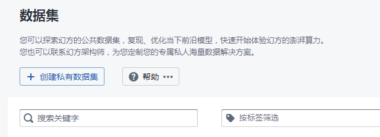
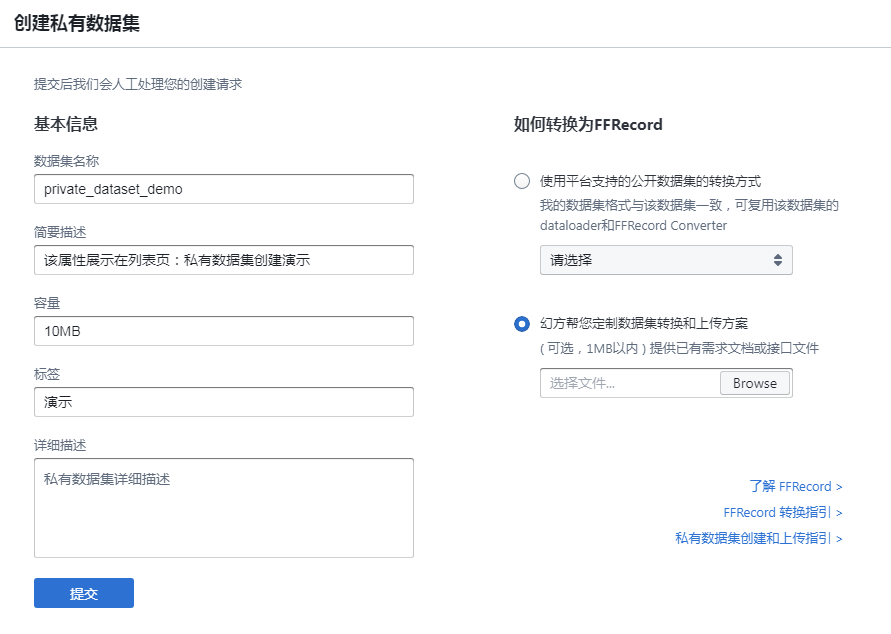
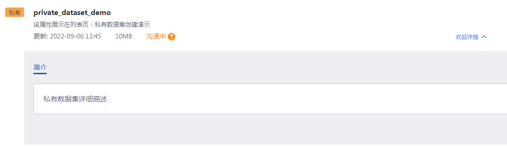
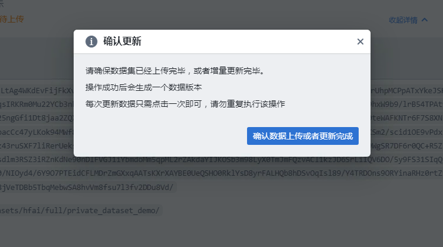

# 数据集管理

## 数据格式　

HAI Platform 集群建议配备幻方 AI 自研的[高性能分布式存储系统 3FS](https://www.high-flyer.cn/blog/3fs/)。该文件系统针对深度学习模型训练场景进行优化，提供大规模高性能的随机读取能力。和一般的文件系统不同，3FS 文件系统有如下的一些特点：

+ 大量打开、关闭小文件的开销比较大
+ 支持高吞吐的随机批量读取

使用该文件系统，训练数据要转换成 [FFRecord 格式规范](https://www.high-flyer.cn/blog/ffrecord/)，以充分利用 3FS 文件系统的高效读取性能，其包括如下优势：

+ 合并多个小文件，减少了训练时打开大量小文件的开销，对存储后端更加友好
+ 支持随机批量读取，提升读取速度
+ 包含数据校验，保证读取的数据完整可靠

## 工作流

HAI Platform 集群管理数据集按权限分为**公开数据集**和**私有数据集**。公开数据集由平台统一管理，所有用户可访问。私有数据集由用户创建、上传，同组用户可访问。

上传私有数据集方式取决于集群存储管理和访问方式。通常的上传流程是：

1. 用户创建私有数据集申请，提供数据集描述信息；

    
    
    

2. 管理员审核通过，允许数据上传；
3. 用户获取中间存储（如 OSS）临时授权（设定有效期），使用对应工具将数据上传到中间存储，并确认完成；

    
    
    
    
4. 管理员审核中间存储中的数据，按规则中转到存储位置，为用户挂载访问路径

**注意**：数据中转的方式主要由集群网络、访问权限决定，如果集群存储开放用户直接上传的方式，则无需中转。

