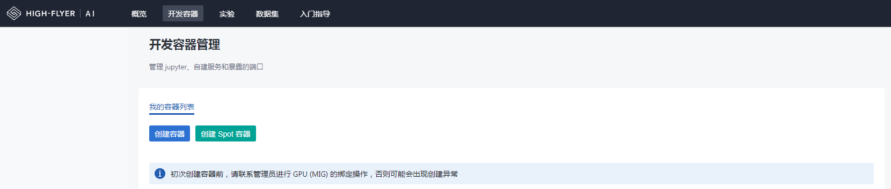

# 环境配置

运行环境是用户前期使用集群最关注的问题之一。 HAI Platform 提供两种方式配置环境：

- 使用 `haienv` 调用 HAI Platform 默认环境（默认环境由集群提供）
- 使用 `haienv` 自建虚拟环境

这两种方式的区别如下：

|         |       默认环境       |     自建环境         |
| ------- | ----------------------- | ----------------------- |
| 使用方式 | 提交任务时指定默认环境 | 开发容器中用 `haienv create` 命令创建环境，提交任务时指定自建环境 |
| 是否支持自定义 | 不支持 |  支持扩展基础环境，或自定义虚拟环境 |
| 是否支持本地（集群外）使用| 不支持 | 仅当本地环境与 HAI Platform 集群环境匹配时可使用，包括系统、GPU驱动、CUDA版本等 |


## 使用 haienv 调用集群默认环境

在集群提供基础环境并包含大部分主流依赖包的情况下，用户有如下使用方式：
（**建议用户在开始使用时先测试该环境是否可以满足运行需求**）


1. 不做代码更改，在使用 `hai-cli python`、`hai-cli bash` 或 `hai-cli exec` 提交任务时，命令行中指定运行环境：

    ```shell
    HF_ENV_NAME=< base_env_name > hai-cli python sample.py -- -n 1 --name test_exp_1
    HF_ENV_NAME=< base_env_name > hai-cli bash sample.sh -- -n 1 --name test_exp_1
    HF_ENV_NAME=< base_env_name > hai-cli exec mybin -- -n 1 --name test_exp_1
    ```

2. 在运行python代码中，使用`haienv`加载运行环境：

    ```python
    import haienv
    haienv.set_env('env_name')
    ```

3. 在运行shell代码中，使用`source`命令加载运行环境：

    ```shell
    source haienv < base_env_name >
    ```

## 使用 haienv 自建虚拟环境

在基础环境无法满足用户需求的情况下（比如python版本、依赖包等），用户使用`haienv`工具创建和管理个人环境。

通常建议用户直接从集群基础环境中扩展配置个人环境。这种方式是**增量**的，**仅需要安装集群默认环境里缺少的依赖即可**。扩展配置环境需要在[**开发容器**](./studio)中操作。开发容器功能入口如下图所示：



HAI Platform 提供两种资源模式的开发容器


|         |    mig-gpu 开发容器     |    spot 开发容器        |
| ------- | ----------------------- | ----------------------- |
| 创建入口 | | |
| 资源分配 | 多个用户容器共享节点，每个容器绑定一个mig切分GPU | 每个容器独占一个节点（8卡）|
| 生命时长 | 默认24小时，活跃期间随时可续 | 无固定时长，根据集群资源需求随时回收 |
| 启动条件 | 用户配额内随时可启动 | 根据集群资源需求动态开放 |


**注意**：这种操作无法将配置好的环境拉取到本地，代码无法在本地进行测试调优。如果您需要 Debug 代码，可以在开发容器中执行。


**具体的使用方式如下：**

首先进入开发容器命令行，通过如下命令创建用户环境：

```shell
haienv create < myenv >
``` 

注意不加 `--no_extend` 命令表示从 HAI Platform 默认环境扩展构建用户环境，最大降低环境配置的工作量。环境创建后即可进入环境并执行自定义安装。

除此以外，`haienv`支持用户在本地（集群外）建立个人环境并推送到集群，这种方式建立的环境无法扩展基础环境，需要用户自己验证和维护。

自建环境与集群默认环境使用方式相同，支持提交任务指定和代码中加载。
