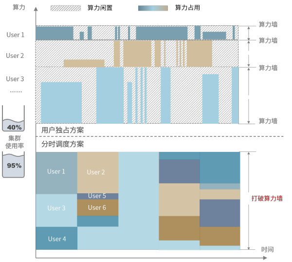
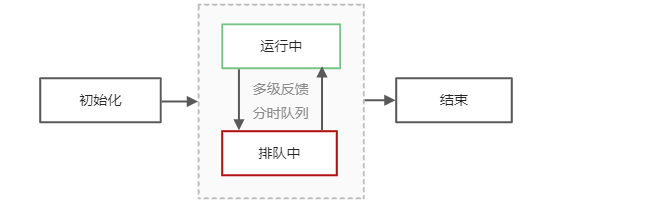
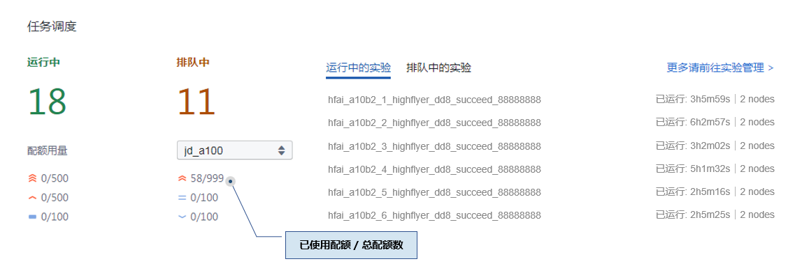

# 分时调度

## 概述

HAI Platform 采用**任务级分时调度**的底层设计，给每个任务分配集群运行时间片（类似操作系统的时间片调度）。

与传统的用户独占方案相比，分时调度大幅提高了集群使用率，以此有效降低单位GPU时的使用成本；同时，分时调度较为弹性的资源占用方式，使得用户无需承担闲置算力成本，并可以根据任务需求实时增减节点配额，轻负担享受全量算力。

按照分时调度的方案规则，训练任务**会被中断、并自动调起**。因此在 HAI Platform 上运行的代码需要遵循本页下方文档的[**编码要求**](#id8)。




## 调度规则

- 任务调度按照**优先级从高到低**调度任务
- 同一优先级按照 **“先到先服务”** 原则排队等待被分配时间片
- 对于同一用户、同优先级的任务，不会打断运行中的任务来调度另一个任务
- 一个 `ABOVE_NORMAL` 的任务运行满30分钟后，自动降级为 `NORMAL`
- 任何任务恢复运行，都是从头执行任务代码，用户需按照编码要求进行**断点编码**处理


## 基本要素
### 任务状态

任务状态分为：**等待初始化**、**运行**、**排队挂起**、**结束（运行成功/失败）** 四种状态，流转示意图如下：




### 任务优先级


### 获取优先级配额

用户在每个优先级上都有节点配额，该配额数表示最多可以同时使用的节点数，参见下方调度界面样例。配额调整请集群联系管理员。




## 编码要求

### 任务优雅挂起
所有任务都参与分时调度，因此任务必须支持断点续跑。任务挂起前，主节点会收到一个挂起命令，如果任务没有响应，过5秒会被强制挂起。可以使用以下接口实现优雅挂起：

1. `hfai.client.receive_suspend_command() -> bool`:
    * 查询是否收到了挂起的命令，返回True表示要挂起
    * 只有主节点（Rank 0）才能收到挂起命令，且主节点的所有python子进程都能收到挂起命令，而其他节点收不到

2. `hfai.client.go_suspend()`：
   * 通知调度系统可以打断，最多预留5秒进行断点的保存
   * 任一个节点调用本函数都会导致任务被优雅挂起，本函数不返回。
   

下面是一个训练的代码参考：

```python
import torch
import hfai

def main(gpu_id):
    torch.cuda.set_device(gpu_id)

    # 初始化模型、数据集、迭代器等

    for epoch in range(epochs):
        # 训练一个step
        if hfai.distributed.get_rank() == 0 and gpu_id == 0: # 获取当前节点序号。在0号节点的0号进程上接收集群调度信息
            if hfai.client.receive_suspend_command(): 

                # 保存模型、迭代器等参数到文件

                time.sleep(5) # 最多预留5秒完成断点保存，之后会被强制打断
                hfai.client.go_suspend()

if __name__ == '__main__':
    ngpus = torch.cuda.device_count()
    hfai.multiprocessing.spawn(main, args=(), nprocs=ngpus, bind_numa=True)
```

### 断点续跑

任务接受集群的统一调度，每个被打断的任务重新拉起运行时，会从头执行运行命令。因此，为了实现模型不受打断影响持续训练，需要用户在代码中设置好**断点**，即做好现场的保存，实现**断点续跑**功能。

如下例所示：

```python
if hfai.distributed.get_rank() == 0 and gpu_id == 0 and hfai.client.receive_suspend_command():
    state = {
        'model': model.module.state_dict(),
        'optimizer': optimizer.state_dict(),
        'acc': best_acc,
        'epoch': epoch,
        'step': step + 1
    }
    torch.save(state, save_path / 'latest.pt')
    time.sleep(5)
    hfai.client.go_suspend()
```

上述代码保存了模型、迭代器的参数和训练的epoch、step，方便在下次执行时恢复当前现场。


### 分布式训练
   
在 HAI Platform 上**每个任务最少使用8张卡**，在启动每个任务时会设置如下环境变量：
     
+ `MASTER_IP`： 我们规定 rank 0 为主节点，该环境变量为主节点的 IP；
+ `MASTER_PORT`：主节点用于通讯的端口，初始值为 2222；
+ `WORLD_SIZE`：标记当前任务总共有几个节点的环境变量；
+ `RANK`：标记当前节点是第几号节点的环境变量。

以此发起分布式训练。更多完整训练案例，可以参考[模型仓库](https://github.com/HFAiLab/hfai-models)