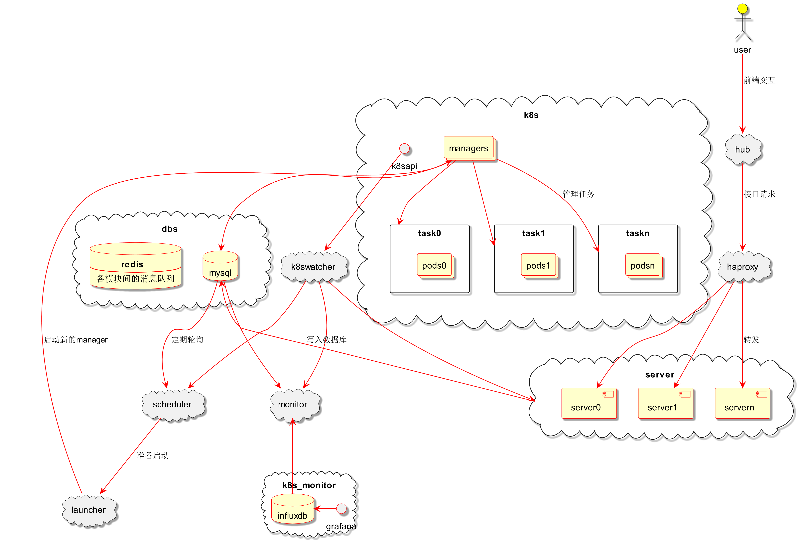
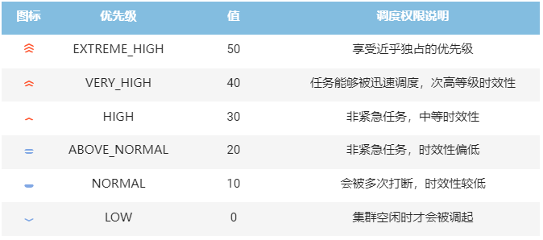
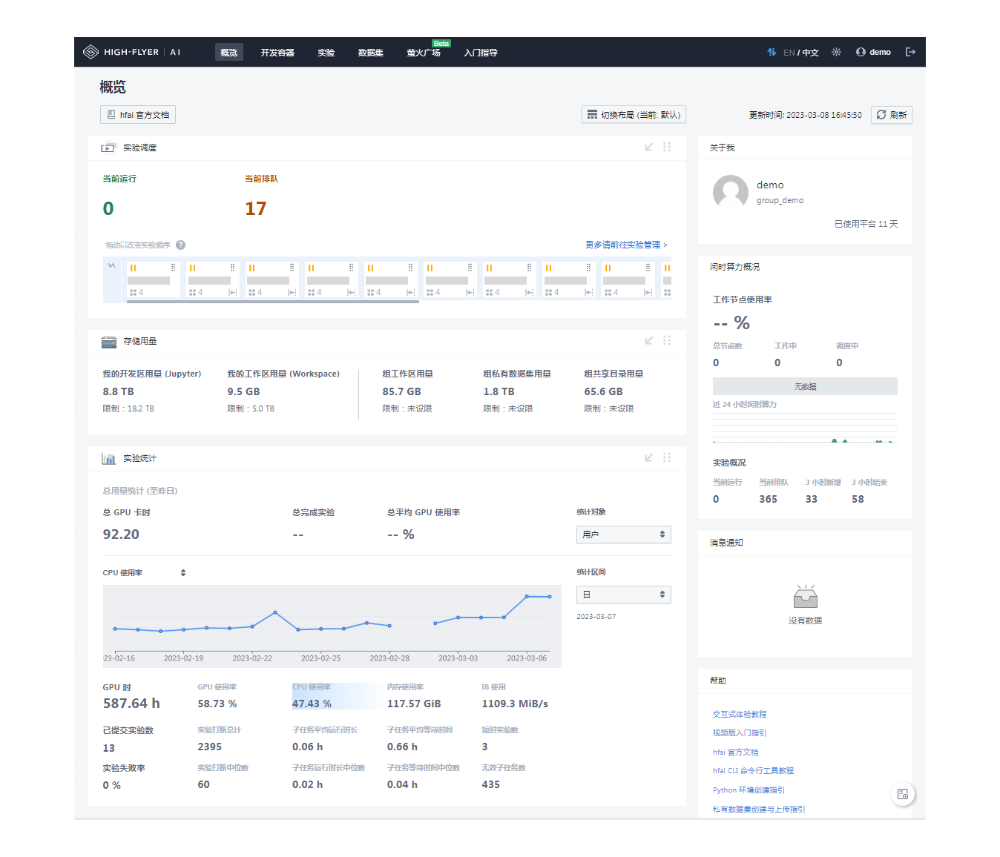

#  基本介绍

构建一个能管理大规模 GPU 集群资源的 AI 平台，主要会遇到如下几个痛点问题：

- **资源调度**：算力规模不断扩大，而训练任务的计算需求又多种多样，如何处理任务和算力的关系以最大化集群资源使用？
- **使用效率**：集群使用有峰谷差异，同时又要应对突发任务的需求，如何兼顾时效性和集群整体效率？
- **迭代适配**：集群会有升级迭代，在调整算力规模、类型、使用规则等场景下，如何让平台快速适配，尽可能降低切换成本？

针对上述问题，幻方 AI 在自建的萤火集群上进行多年的研发与测试，积累了**一套高效管理 GPU 集群资源的 AI 训练平台方案，名叫 HAI Platform**。其**以任务级分时调度共享 AI 算力的理念将集群零散资源进行整合再分配**，成功支持在 1500+ 计算节点上稳定运行深度学习训练和其他多类型任务，日常算力占用率 95% 以上，日常 GPU 使用率 75% 以上，计算和存储节点间的数据吞吐 7TB/s 以上。

HAI Platform 可以部署在您的私有集群中，帮助您高效利用 GPU 集群资源，提升团队整体研发效率。

## 产品架构

HAI Platform 主要由8个模块组成，可以分为：
- 交互及接口：hub, haproxy, server
- 任务调度和管理：scheduler, launcher, manager, k8swatcher
- 监控及固化：dbs, monitor

整体架构如下图所示：

这些模块互相协作形成服务主体，基本的流程是：
1. 用户请求经由 hub、haproxy 到达 server 处理 api 响应，任务信息写入数据库；
2. scheduler 定期轮询数据库中未完成的任务，按调度规则选出可启动的任务交给 launcher；
3. launcher 负责为任务创建 k8s 对象，包括每个任务的 manager 和执行 pod；
4. k8swatcher 为服务请求提供缓存。

## 核心概念

### 资源管理

#### 计算资源

平台记录所有接入集群的算力节点，按资源类型（cpu，gpu等）、网络区域等条件分类标记，节点是算力资源分配的基本单位。

部署 HAI Platform 的集群不会将 GPU 资源池化，而是**以计算节点为单位，鼓励用户所提交的任务一次性用满多张 GPU，进行并行训练**。
用户提交任务时需选定节点数量 n，则该任务可获得 n 的整数倍个 GPU，比如在8卡计算节点上提交使用4个节点的任务，则该任务会获得32张 GPU 进行并行训练。每个任务**至少使用 1 个节点**。

#### 存储资源

平台及所有算力节点需要连接**集中存储**，管理文件内容包括：

- 运行时需要的配置文件、启动脚本
- 服务日志
- pgsql、redis等持久化文件目录
- 用户工作区文件目录，包括代码、配置文件、数据文件、任务运行日志等
- 虚拟环境文件目录
- 数据集

通常在分布式训练过程中，数据集需要通过高速文件系统读取，以提高训练效率，因此建议根据容量和性能需求搭建多个文件系统，并合理设计分配流量。

### 任务调度

#### 任务

HAI Platform 的用户使用集群资源都是以**任务**的方式提交给平台，例如提交运行python代码、运行bash代码、启动开发容器等。

**任务是 HAI Platform 使用的基本单位，而非用户**。所有用户提交的任务都由 HAI Platform 统一管理和调度。

#### 分时调度

部署 HAI Platform 的集群以**分时调度**的方式为任务分配计算节点，根据当前资源需求、集群忙闲程度等进行任务的中断和加载，**任务代码需要遵循平台编码规则以确保可以断点续跑**，具体包括：

- 接受集群的打断信号；
- 保存 checkpoint（模型参数，优化器参数等）；
- 通知集群打断；
- 从 checkpoint 恢复，继续运行。

具体操作请阅读[分时调度](../guide/schedule)篇章内容。

### 用户管理

#### 用户配额

HAI Platform 以**配额**的方式记录集群的各类资源，通过**优先级**管理用户的使用权限，例如：某用户在 NORMAL 优先级上有10个 GPU 节点的配额。其在 HAI Platform 上提交若干个任务，则最多同时以 NORMAL 优先级调度10个计算节点运行。
算力资源优先满足高优先级用户的训练需求。同优先级内交替使用集群算力资源。

#### 用户组

每个用户都属于一个用户组，资源和优先级配额按用户分配，同组用户可以共享虚拟环境、私有数据集。

#### 管理员权限

管理员身份的用户有权限执行用户创建、停用、归档等操作，调整各类资源及优先级配额，后台管理开发容器等。

### 工作区

用户使用 HAI Platform 进行 AI 训练，需要先完成代码、数据、环境等迁移到集群。平台按用户、用户组在集群建立和管理工作区、数据集仓库。

工作区是用户在集群上自主管理的存储空间，有以下使用场景：
1. 用户使用集群开发容器，已挂载工作区路径，在终端命令行访问；
2. 用户在本地环境（集群外），使用平台提供的客户端工具与集群侧工作去目录同步、文件传输；
3. 用户提交任务运行，任务容器挂载工作区路径，执行工作区路径下的代码。

### 环境管理

部署 HAI Platform 的集群会包含**基础环境**和用户**自定义环境**两种环境管理模式：

- 基础环境由平台统一管理，包含大部分主流依赖包，任务运行时默认加载。通常根据系统、GPU驱动及cuda版本等要求统一管理若干个基础环境。
- 自定义环境由用户通过客户端工具按需求安装依赖，同组用户可共享。

两种环境都可以通过 [`haienv`](../cli/ugc.rst) 工具进行管理，适用于各种任务场景。通过基础环境的构建，我们希望尽可能降低 AI 研发前期的环境构建成本。

更多细节请阅读[环境配置](../guide/environment)篇章内容。

### 可视化交互

开发容器额外运行了 JupyterLab 服务，支持可视化和交互式的开发方式：

更多细节请阅读 [Studio](../start/studio) 篇章内容。

### 数据管理

部署 HAI Platform 的集群会将训练数据存储在文件系统中。训练中的任务会实时从文件系统中读取数据，流转到计算节点。这里，优良的文件系统将是提高 GPU 利用率，进而提升集群整体效率的决定性因素之一。

为了最大化 GPU 利用率，降低数据读取的成本，幻方 AI 自研了[高速文件系统 3FS](https://www.high-flyer.cn/blog/3fs/)，其专门针对深度学习训练中样本读取的场景进行优化，能支持计算和存储节点间 7TB/s 以上的数据吞吐。3FS 需要用户将原始数据中较多的小文件聚合成大文件进行存储，推荐使用[ FFRecord 格式规范](https://www.high-flyer.cn/blog/ffrecord/)来聚合文件。

